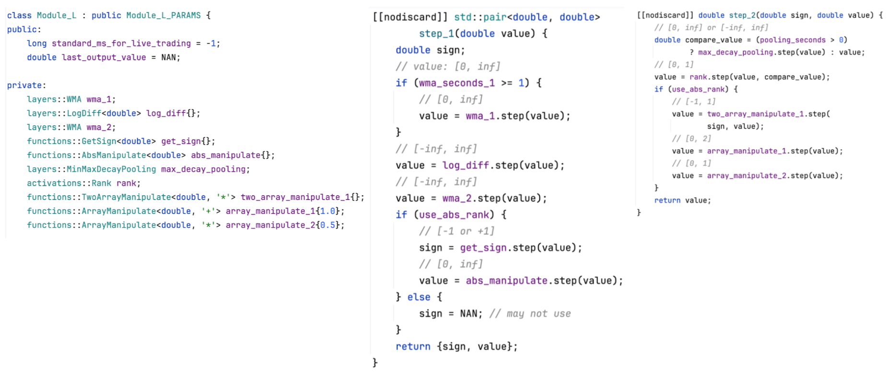
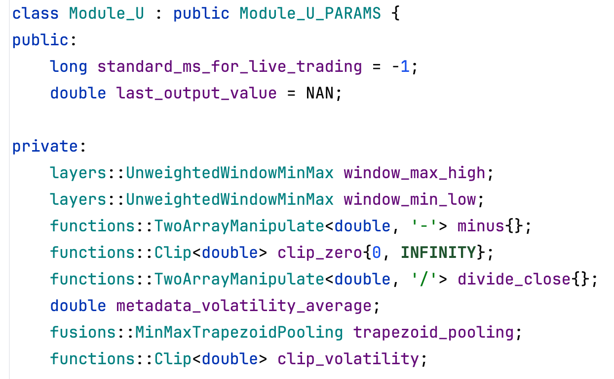
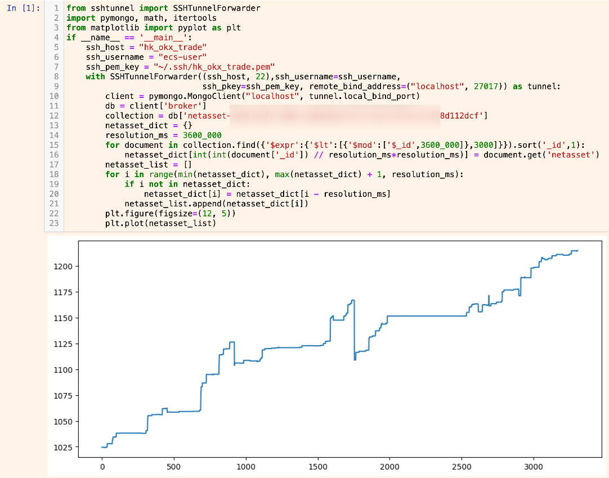
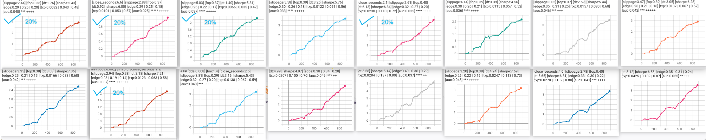
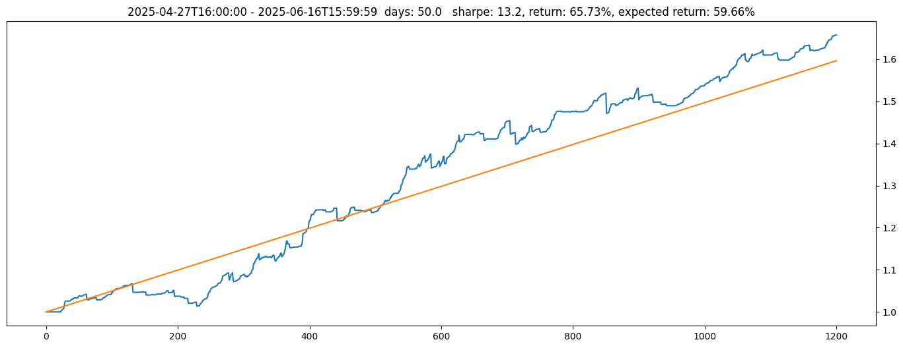
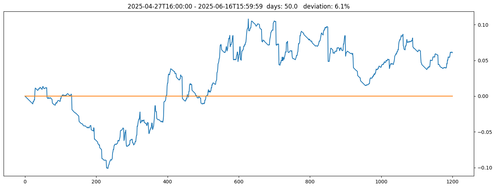
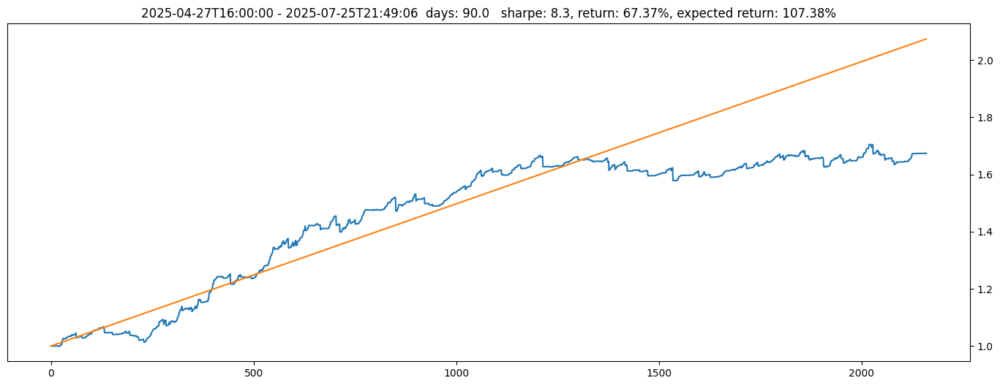
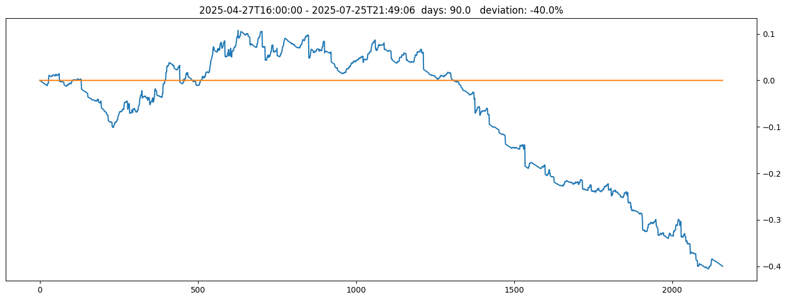
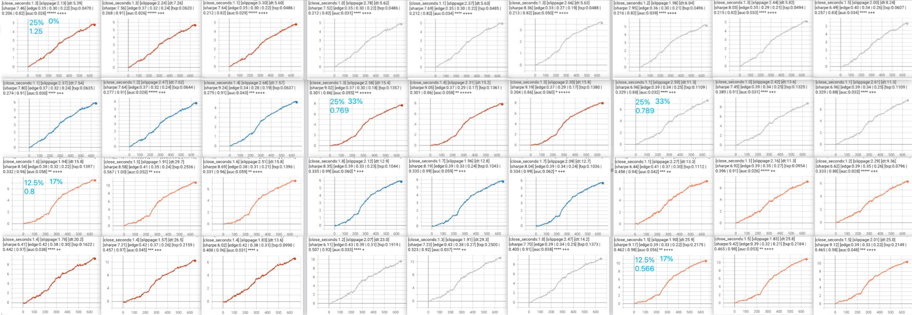

<h1 align="center">C++ Quant-Native Deep Learning Framework Demo</h1>

nliu12@illinois.edu

  

<ul>
  <li>Use framework to build modules and construct the model:</li>
</ul>

 

  

  

Module_L is one of our most frequently used modules for measuring the magnitude of market moves, both upward and downward. The core logic has three steps: first, compute the log_diff at the minimum kline close resolution; second, apply a WMA to the log_diff series; and third, take the rank of the WMA to obtain its percentile in the historical distribution.

 

  

 

2) Build the model in strategy

2.1) In the first stage, the model uses module_l to compute the price movement magnitude over a short window (e.g., 1 hour), normalized to [0, 1].

2.2) It then uses module_l again to compute the price movement magnitude over a longer window (e.g., 12 hours), also scaled to [0, 1].

2.3) Next, apply module_u to estimate volatility, which sets a flexible distance over time between the open-position orders and the bid/ask.

2.4) The model then defines valid ranges for the two module_l outputs. New orders are opened only when the outputs lie within these ranges (e.g., rank_1 &gt; 0.1 means a position is opened only when the price move lies in the 0.1–1.0 quantile of its historical distribution).

2.5) Additional parameters are configured for other model functionalities.

<strong>2.6) The goal of this model is straightforward:</strong> Place limit orders at lower prices and capture occasional market inefficiencies when these orders get filled. These opportunities do not occur every day, so the NAV curve often shows flat, non-trading periods; however, when trades do occur, they are generally low risk.

  

<h4>Live-trading nav curve for this model:</h4>

  

 

<strong>At step 1750</strong>, the loss came from a model flaw. The market jumped 4% in 3 seconds, my model placed orders, and then the price reverted to its prior level within another 3 seconds, causing a loss.

I could fix this by changing the model: the order price should reference the minimum mid-price over the past 30 seconds (or another window), rather than the current mid-price. This adjustment does not remove profitable signals, because the profitable cases all occur when price is either falling or stable, not when it spikes upward. Therefore, excluding upward-spike scenarios removes the losing trades while preserving the good ones.

<strong>At step 900</strong>, the drop was caused by a sharp price decline that triggered the strategies’ stop-loss mechanisms, which limits the maximum loss and profit for each trade. This was not a model flaw and cannot be filtered out.

From step 2000 to 2500, I overlooked this cloud instance, which caused the disk to fill up and all the programs to crash.

 

<h4>Backtest log-NAV curve for this model:</h4>

  

 

For the backtest log-NAV curve, I selected five sub-strategies for live trading, <strong>roughly steps 0–335 are in-sample, and steps 335–900 are out-of-sample (40%/60% split)</strong>, which differs from the common 70%/30% split, because 335 days data is sufficient to train the model, and a longer out-of-sample window improves statistical confidence. The backtest sub-strategies’ edge metric is about 0.23-0.32, defined as sum(24h log-return loss) / sum(24h log-return change), similar to RSI.

  

<strong>2.6) For other purposes, such as building a trend-following strategy</strong>. Each time I send a buy order, I want the order to fill as quickly as possible: if bid-1 rises, I move the order up; if bid-1 falls, my order gets filled, using a marker-only order. This behavior is what a trend-following model needs.

 

<h4>Live-trading nav curve for this trend-following strategy:</h4>

  

  

 

This strategy is temporarily shut down because I deployed too much capital about 50 days (1,200 steps) after launch, which caused the alpha factor to disappear. Before that, the deviation between live trading return and expected return (backtest weighted returns) stayed within ±10%. The alpha may re-emerge after a few months of inactivity. I shut the strategy down on July 25, when the return deviation reached 40%, and I was preparing to move to the US for MFE program, so I no longer had time to monitor it properly.

  

<h4>Live-trading nav curve when I deployed too much capital:</h4>

  

  

  

<h4>Backtest log-NAV curve for this trend-following strategy:</h4>

  

 

<h4>Roughly steps 0–315 are in-sample, and steps 315–650 are out-of-sample (50%/50% split).</h4>

  

<h4>3) Additional interesting aspects</h4>

3.1) Using this deep-learning-style model, the strategy is able to generate stable profits. The optimizer runs hundreds of millions of backtest iterations, each with 300 to 500 million steps, giving the model a fitting capacity comparable to deep learning on CUDA hardware while still allowing classical statistical methods to be used at the observation point to control overfitting.

3.2) We define the theoretical limit of backtesting engine used by optimizer as follows: we first run a slow backtest to obtain all filled orders. We then store these orders along with its timestamp, price, size, and direction in an array. Next, we use C++ iterate through the array and compute the PnL for each order. The total time required for this final pass of computing PnL is treated as the theoretical lower bound of computation of backtesting engine, which directly determines the optimizer’s available throughput in the framework.

3.3) When a position is closed, exit orders are placed into the model's queue. For a long position, the first sell order is positioned near ask-1. As the price rises, some queued orders are filled; as the price falls, all the queued orders shifts downward so that the leading order remains near ask1. We also apply SL_1_10000 in the model to size each order and space them at 1/10,000 intervals. For example, if SL_1_10000 = 0.1, then each 1/10,000-step interval order uses only 10% of total capacity, ensuring proper strategy-level capacity throttling.

